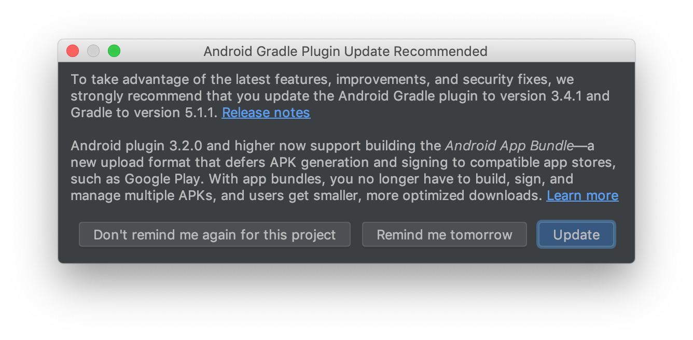

# hello-flutter-boost

### 开发环境

#### Flutter

版本 `v1.5.8`

``` bash
flutter version v1.5.8
```

FlutterBoost 暂不支持更高版本的 Flutter。

#### FlutterBoost

分支 `flutter_1.5_upgrade_opt`

``` yaml
flutter_boost2:
  git:
    url: 'https://github.com/alibaba/flutter_boost.git'
    ref: 'flutter_1.5_upgrade_opt'
```

#### 其他

升级 gradle 不影响使用。



